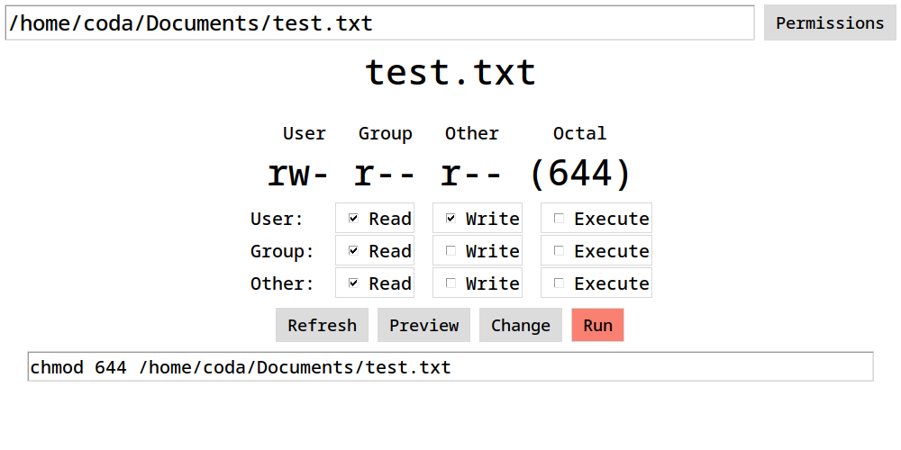
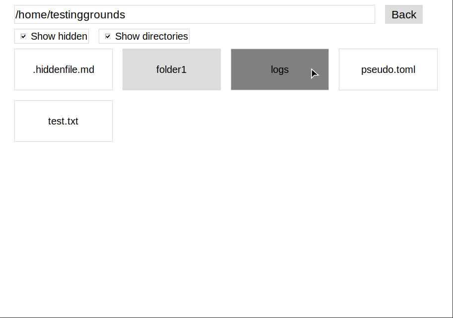

<h1>Hectic Permissions Manger</h1>

<h3>
  Linux / Unix Permissions Explorer and Editor 
</h3>

  <a href="#">Preview</a> •
  <a href="#">Features</a> •
  <a href="#">Configuration</a> •
  <a href="#">Known Issues</a>

## Preview

