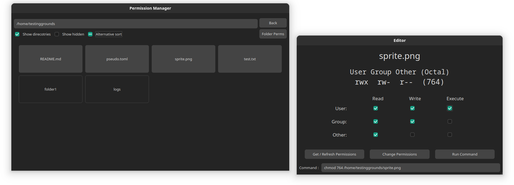

<h1>Hectic Permissions Manger</h1>

<h3>
  Linux / Unix Permissions Explorer and Editor in Qt 
</h3>

  <a href="#">Preview</a> •
  <a href="#">Features</a> •
  <a href="#">Configuration</a> •
  <a href="#">To Do</a> •
  <a href="#">Tk archive Preview</a>
 

## Preview

## Features
### File Explorer
- Typical file explorer to traverse directories
- Path can be edited manually via the text box and the return key
- Option to hide/show hidden files and directories
- Alternative sorting with separation between files and folders
### Permissions Editor
- Files and Directories permissions can be edited
- Human and octal permissions previews
- Permissions can be edited via Read, Write and Execute checkboxes for User, Group and Other
- Command preview with via the `Change Permission` button
- Visual feedback of command return status

## To Do
- Autocorrect of capitalization of file/directory names
- More settings in toml
- View and edit file/folder ownership
- Run privileged commands via sudo
- Optimise for large folders

## Preview of initial implementation in Tk

